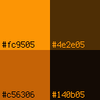

# Amber Mono


A 4-color theme inspired by amber monochrome displays. If you make a theme using this color scheme, feel free to make a pull request!

***

## i3

```
bar {
	colors {
  	background #140b05
		statusline #fc9505
		separator  #fc9505
		focused_workspace  	#fc9505 #fc9505 #140b05
		inactive_workspace 	#fc9505 #140b05 #c56306
		urgent_workspace	#fc9505 #fc9505 #140b05
	}
}

# class                 border  backgr. text    indicator child_border
client.focused          #fc9505 #fc9505 #140b05 #fc9505   #fc9505
client.focused_inactive #fc9505 #140b05 #fc9505 #fc9505   #c56306
client.unfocused        #fc9505 #140b05 #c56306 #fc9505   #4e2e05
client.urgent           #fc9505 #fc9505 #140b05 #fc9505   #4e2e05
client.placeholder      #fc9505 #140b05 #4e2e05 #fc9505   #4e2e05

client.background       #140b05
```

## Rofi

`amber-mono.rafi` is a Rofi theme file which creates a dmenu replacement in this color scheme. Copy it to `~/.local/share/rofi/themes/` and use rofi-theme-selector to enable it.

## Pleroma

`amber-mono.json` is a Pleroma theme file. It can be loaded using the "Load Preset" button in the "Theme" settings tab.
